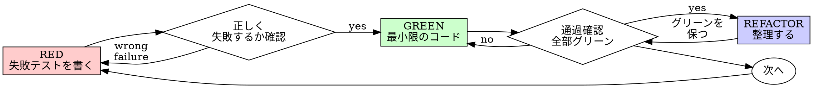

# テスト駆動開発（TDD）

## 概要

テストを先に書く。失敗するのを見る。通るための最小限のコードを書く。

**原則:** テストが失敗するのを見ていなければ、それが正しいものをテストしているか分からない。

**このルールの文言を破ることは、精神を破ることと同じである。**

## 使いどころ

**常に使う:**

- 新機能
- バグ修正
- リファクタリング
- 振る舞いの変更

**例外（ユーザーに確認する）:**

- 使い捨てプロトタイプ
- 生成コード
- 設定ファイル

「今回だけ TDD をスキップしよう」と思ったら止まる。それは合理化だ。

## 鉄則

```
失敗するテストなしに本番コードを書いてはならない
```

テストより先にコードを書いた？ 削除する。やり直す。

**例外なし:**

- 「参照用に残す」はしない
- テストを書きながら「適応」はしない
- 見ない
- 削除は削除を意味する

テストから新鮮に実装する。以上。

## RED-GREEN-REFACTOR



### RED — 失敗するテストを書く

何が起きるべきかを示す最小限のテストを一つ書く。

<Good>
```typescript
test('retries failed operations 3 times', async () => {
  let attempts = 0;
  const operation = () => {
    attempts++;
    if (attempts < 3) throw new Error('fail');
    return 'success';
  };

const result = await retryOperation(operation);

expect(result).toBe('success');
expect(attempts).toBe(3);
});
````
明確な名前、実際の振る舞いをテスト、一つのことだけ
</Good>

<Bad>
```typescript
test('retry works', async () => {
  const mock = jest.fn()
    .mockRejectedValueOnce(new Error())
    .mockRejectedValueOnce(new Error())
    .mockResolvedValueOnce('success');
  await retryOperation(mock);
  expect(mock).toHaveBeenCalledTimes(3);
});
````
名前が曖昧、コードではなくモックをテストしている
</Bad>

**要件:**

- 一つの振る舞い
- 明確な名前
- 実際のコード（避けられない場合だけモック）

### RED を確認する — 失敗するのを見る

**必須。スキップ禁止。**

```bash
pnpm test path/to/test.test.ts
```

確認すること:

- テストが失敗している（エラーではなく）
- 失敗メッセージが期待通り
- 機能が存在しないために失敗している（タイポではなく）

**テストが通った？** 既存の振る舞いをテストしている。テストを修正する。

**テストがエラー？** エラーを修正し、正しく失敗するまで再実行する。

### GREEN — 最小限のコード

テストを通す最もシンプルなコードを書く。

<Good>
```typescript
async function retryOperation<T>(fn: () => Promise<T>): Promise<T> {
  for (let i = 0; i < 3; i++) {
    try {
      return await fn();
    } catch (e) {
      if (i === 2) throw e;
    }
  }
  throw new Error('unreachable');
}
```
通すのに十分な最小限
</Good>

<Bad>
```typescript
async function retryOperation<T>(
  fn: () => Promise<T>,
  options?: {
    maxRetries?: number;
    backoff?: 'linear' | 'exponential';
    onRetry?: (attempt: number) => void;
  }
): Promise<T> {
  // YAGNI
}
```
過剰設計
</Bad>

テストが要求していない機能追加・他コードのリファクタリング・「改善」はしない。

### GREEN を確認する — 通るのを見る

**必須。**

```bash
pnpm test path/to/test.test.ts
```

確認すること:

- テストが通っている
- 他のテストがまだ通っている
- 出力がクリーン（エラー・警告なし）

**テストが失敗した？** コードを修正する。テストは修正しない。

**他のテストが失敗した？** 今すぐ直す。

### REFACTOR — 整理する

グリーンになってから:

- 重複を除去する
- 名前を改善する
- ヘルパーを抽出する

テストをグリーンに保つ。振る舞いを追加しない。

### 繰り返す

次の機能のために次の失敗テスト。

## 良いテスト

| 品質 | 良い | 悪い |
| --- | --- | --- |
| **最小** | 一つのこと。名前に「and」がある？ 分割する。 | `test('validates email and domain and whitespace')` |
| **明確** | 名前が振る舞いを説明している | `test('test1')` |
| **意図を示す** | 望ましい API を実演している | コードが何をすべきか不明瞭 |

## 順番が重要な理由

**「動作確認のためにテストを後で書く」**

コードの後に書いたテストはすぐに通る。すぐに通ることは何も証明しない:

- 間違ったものをテストしているかもしれない
- 振る舞いではなく実装をテストしているかもしれない
- 忘れたエッジケースを見逃しているかもしれない
- バグを捕まえるのを見たことがない

テスト先書きは、テストが失敗するのを見ることを強制し、実際に何かをテストしていることを証明する。

**「エッジケースはすでに手動でテストした」**

手動テストはアドホックだ。すべてをテストしたと思っているが:

- テストしたことの記録がない
- コードが変わっても再実行できない
- プレッシャー下でケースを忘れやすい
- 「試したときは動いた」 ≠ 網羅的

自動化テストは体系的だ。毎回同じ方法で実行される。

**「X 時間の作業を削除するのは無駄」**

サンクコストの誤謬だ。時間はすでに過ぎた。今の選択:

- 削除して TDD で書き直す（X 時間追加、高信頼）
- 残してテストを後で追加（30分、低信頼、バグの可能性高）

「無駄」は信頼できないコードを残すことだ。本物のテストのない動くコードは技術的負債である。

**「TDD は教条的で、実用的とは適応を意味する」**

TDD こそ実用的だ:

- コミット前にバグを見つける（デバッグより速い）
- リグレッションを防ぐ（テストがすぐに壊れを捕まえる）
- 振る舞いを文書化する（テストがコードの使い方を示す）
- リファクタリングを可能にする（自由に変更、テストが壊れを捕まえる）

「実用的な」ショートカット = 本番でのデバッグ = 遅くなる。

**「テスト後書きでも同じ目標を達成できる — 精神であってリチュアルではない」**

違う。テスト後書きは「これは何をするか？」に答える。テスト先書きは「これは何をすべきか？」に答える。

テスト後書きは実装によって偏っている。必要なものではなく、作ったものをテストする。思い出したエッジケースを確認し、発見したものではなく。

テスト先書きは実装前にエッジケースの発見を強制する。テスト後書きはすべてを思い出したかを確認する（思い出せていない）。

30分のテスト後書き ≠ TDD。カバレッジは得られるが、テストが機能するという証明を失う。

## よくある合理化

| 言い訳 | 現実 |
| --- | --- |
| 「単純すぎてテスト不要」 | シンプルなコードは壊れる。テストは30秒。 |
| 「後でテストする」 | すぐに通るテストは何も証明しない。 |
| 「テスト後書きでも同じ目標」 | 後書き = 「何をするか？」先書き = 「何をすべきか？」 |
| 「手動でテスト済み」 | アドホック ≠ 体系的。記録なし、再実行不可。 |
| 「X 時間の削除は無駄」 | サンクコストの誤謬。未検証コードを残すことが技術的負債。 |
| 「参照用に残してテストを先に書く」 | 適応することになる。それはテスト後書き。削除は削除を意味する。 |
| 「まず探索が必要」 | 構わない。探索を捨てて TDD で始める。 |
| 「テストが難しい = 設計が不明確」 | テストに耳を傾ける。テストしにくい = 使いにくい。 |
| 「TDD は遅くなる」 | TDD はデバッグより速い。実用的 = テスト先書き。 |
| 「手動テストの方が速い」 | 手動はエッジケースを証明しない。変更のたびに再テストすることになる。 |
| 「既存コードにテストがない」 | 改善しているところだ。既存コードにテストを追加する。 |

## 危険信号 — STOP してやり直す

- テストより先にコードを書いた
- 実装の後にテストを追加した
- テストがすぐに通った
- なぜテストが失敗したか説明できない
- テストを「後で」追加した
- 「今回だけ」を合理化している
- 「手動でテスト済み」
- 「テスト後書きでも同じ目的を達成できる」
- 「精神であってリチュアルではない」
- 「参照用に残す」または「既存コードを適応する」
- 「すでに X 時間かけた、削除は無駄」
- 「TDD は教条的で、実用的なアプローチをとる」
- 「これは違うケースなので...」

**これらはすべて: コードを削除する。TDD でやり直す。**

## 例: バグ修正

**バグ:** 空のメールが受け入れられる

**RED**

```typescript
test("rejects empty email", async () => {
  const result = await submitForm({ email: "" })
  expect(result.error).toBe("Email required")
})
```

**RED を確認する**

```bash
$ pnpm test
FAIL: expected 'Email required', got undefined
```

**GREEN**

```typescript
function submitForm(data: FormData) {
  if (!data.email?.trim()) {
    return { error: "Email required" }
  }
  // ...
}
```

**GREEN を確認する**

```bash
$ pnpm test
PASS
```

**REFACTOR**
必要であれば複数フィールドのバリデーションを抽出する。

## 完了前チェックリスト

作業完了とマークする前に:

- [ ] すべての新しい関数・メソッドにテストがある
- [ ] 実装前に各テストが失敗するのを見た
- [ ] 各テストが期待通りの理由で失敗した（機能が存在しない、タイポではない）
- [ ] 各テストを通すための最小限のコードを書いた
- [ ] すべてのテストが通っている
- [ ] 出力がクリーン（エラー・警告なし）
- [ ] テストが実際のコードを使っている（避けられない場合だけモック）
- [ ] エッジケースとエラーがカバーされている

すべてのボックスにチェックできない？ TDD をスキップした。やり直す。

## 詰まったとき

| 問題 | 解決策 |
| --- | --- |
| テストの書き方が分からない | 望ましい API を書く。アサーションを先に書く。ユーザーに聞く。 |
| テストが複雑すぎる | 設計が複雑すぎる。インターフェースをシンプルにする。 |
| すべてをモックしなければならない | コードが密結合している。依存性の注入を使う。 |
| テストのセットアップが巨大 | ヘルパーを抽出する。まだ複雑？ 設計をシンプルにする。 |

## デバッグとの統合

バグを見つけた？ それを再現する失敗テストを書く。TDD サイクルに従う。テストが修正を証明しリグレッションを防ぐ。

テストなしでバグを修正しない。

## テストのアンチパターン

モックを使う場合は以下の落とし穴に注意:

- 実コードではなくモックの挙動を検証していないか
- テスト専用メソッドをプロダクションクラスに追加していないか
- 依存関係を理解せずにモックを使っていないか

## 最終ルール

```
本番コード → テストが存在し、先に失敗した
そうでなければ → TDD ではない
```

ユーザーの許可なく例外なし。
